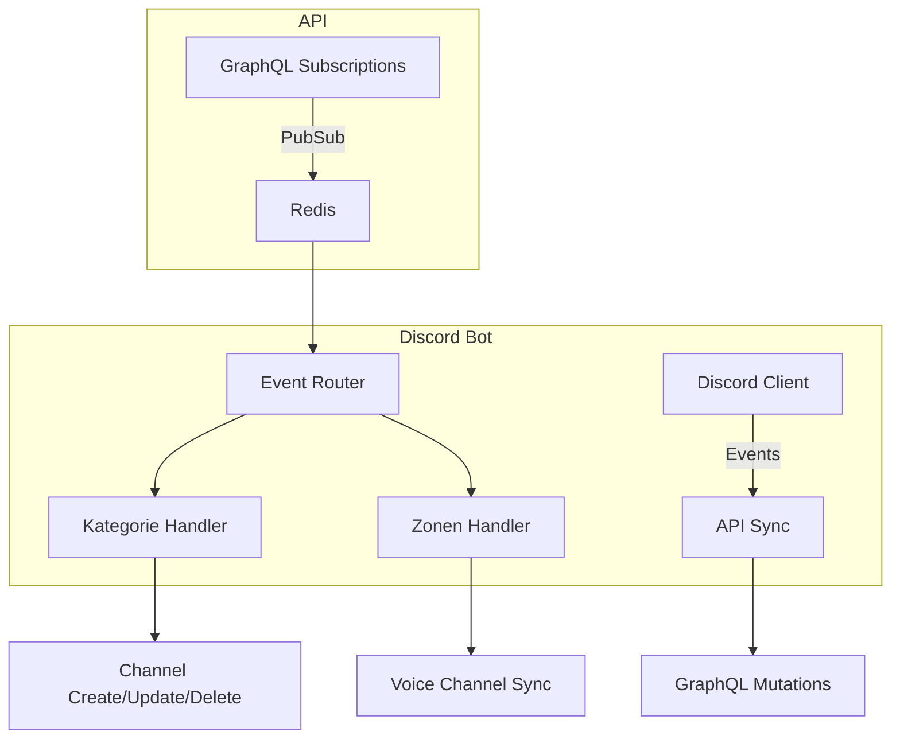

# Discord Bot Sync Implementierungsplan

## Architekturübersicht


## Code-Struktur
```
src/
├── core/
│   ├── discord-client.ts
│   └── pubsub-client.ts
├── services/
│   ├── api-sync.ts
│   ├── channel-manager.ts
│   └── event-service.ts
├── types/
└── utilities/
    ├── discord-utils.ts
    └── redis-serializer.ts
```

## Schlüsselkomponenten

### Typensicheres Event-Handling
```typescript
type PubSubEvent = 
  | { categoryCreated: Category }
  | { categoryUpdated: Category }
  | { categoryRemoved: Category }
  | { zoneCreated: Zone }
  | { zoneUpdated: Zone }
  | { zoneRemoved: Zone };
```

### Sicherheitsmaßnahmen
- **Permission Templates** für Discord-Kanäle
- JSON-Serialisierungskompatibilität mit API
- Guild-ID Validierung bei Events

## Nächste Schritte
1. Integrationstest-Setup erstellen
2. Error-Recovery Mechanismus implementieren
3. Monitoring für PubSub-Events hinzufügen